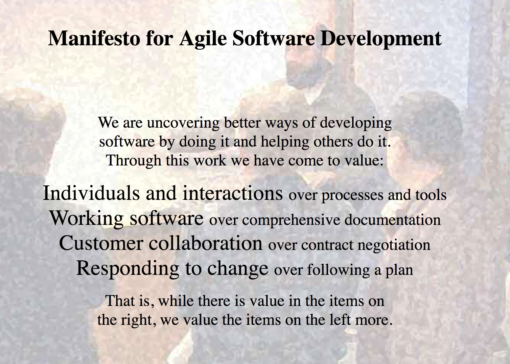

#  Agile Introduction

### Learning Objectives
*After this lesson, students will be able to:*
 - Define the core principles of Agile.
 - Differentiate between the various versions of Agile.
 - Explain the different Scrum roles.
 - Identify the different stages and rituals of a sprint cycle.

## Introduction

Agile software development is a set of frameworks and practices based on the values and principles expressed in the Manifesto for Agile Software Development and the 12 principles behind it. 

The Agile methodology follows the same basic steps as any other product development framework: a combination of planning, building, testing, and deploying. Its steps are broken up into small batches, completed in a full cycle, and repeated frequently. Each full cycle is known as a **sprint**. The length of a team’s sprint varies depending on product complexity, team size, location, and test capacity.

-----

## The Agile Manifesto

"On February 11-13, 2001, at The Lodge at Snowbird ski resort in the Wasatch mountains of Utah, 17 people met to talk, ski, relax, and try to find common ground — and of course, to eat. What emerged was the Agile ‘Software Development’ Manifesto. Representatives from Extreme Programming, Scrum, DSDM, Adaptive Software Development, Crystal, Feature-Driven Development, Pragmatic Programming, and others sympathetic to the need for an alternative to documentation-driven, heavyweight software development processes convened.

"Now, a bigger gathering of organizational anarchists would be hard to find, so what emerged from this meeting was symbolic — a Manifesto for Agile Software Development — signed by all participants. The only concern with the term 'agile' came from Martin Fowler (a Brit) who allowed that most Americans didn’t know how to pronounce the word ‘agile.'"

That is how Jim Highsmith, one of the authors of the manifesto, described this important gathering.

### So, What Did They Come Up With?

 

| Principle | Description | 
| :-----: |:-------:|
|Customer involvement | Customers should be closely involved throughout the development process.Their role is provide and prioritize new system requirements and to evaluate the iterations of the system.
Incremental delivery |The software is developed in increments with the customer specifying the requirements to be included in each increment. |
People not process |The skills of the development team should be recognized and exploited. Team members should be left to develop their own ways of working without prescriptive processes. |
Embrace change |Expect the system requirements to change and so design the system to accommodate these changes. |
Maintain simplicity |Focus on simplicity in both the software being developed and in the development process. Wherever possible, actively work to eliminate complexity from the system.. |

 

 

---
 

> **Knowledge Check**: Why can Agile be a scary or difficult thing for companies to implement?

 

---

## Agile development methodologies

Agile is a concept: A collection of principles and ideas that describes how teams can build products quickly and remain focused on the customer. But Agile itself is not a way of working with defined roles, processes, and tools.

To “be” Agile, you have to choose a development methodology to help implement its principles and ideas. The most common methodologies are:

*	**Scrum**

       - [Scrum](../scrum/README.md)
    
     
*	**Extreme programming**
       - [Extreme programming](../extreme-programming/README.md)

     
### Which Method Is Best? 

It depends.

There are lots of factors to take into account when choosing a development methodology, even if you’re just testing it out for a short period of time.

---

## Conclusion

If that seemed like a ton of Agile talk, never fear. We'll be practicing standups and retros during our project weeks so that we can stay accountable and keep moving forward.

### Resources

*	[Manifesto for Agile Software Development](https://agilemanifesto.org/)
*	[Agile Alliance](https://www.agilealliance.org/)
*	[Scrum Reference Card](http://scrumreferencecard.com/scrum-reference-card/)

---