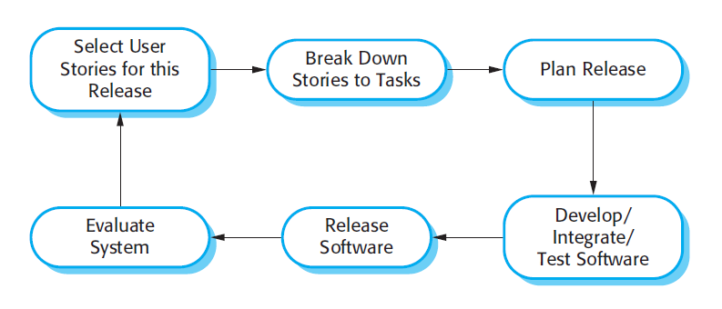
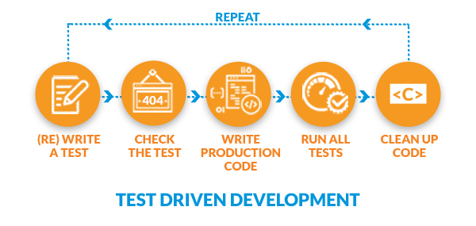

## Opening 

*Embrace Change!*

**Extreme programming (XP)** is perhaps the best known and most widely used of the
agile methods. The name was coined by Beck (2000) because the approach was
developed by pushing recognized good practice, such as iterative development, to
‘extreme’ levels. For example, in XP, several new versions of a system may be developed
by different programmers, integrated and tested in a day.

> "Extreme Programming (XP) is an Agile software development framework that aims to produce higher quality software and higher quality of life for the development team." 

Extreme programming stresses customer satisfaction and emphasizes teamwork. It's closely associated with TDD (test-driven development) and characterized by:

- Early, iterative releases of software.
- An incremental planning approach.
- Flexible scheduling.
- Automated testing.
- Frequent customer feedback.
- Teams made up of managers, customers, and developers.

### How Extreme Is "Extreme"?

The "programming" part of extreme programming is self-explanatory, but why "extreme"? Beck says he took common-sense principles and practices and pushed them to "extreme" levels:

- If code reviews are good, we’ll review code all the time.
- If testing is good, everybody will test all the time.
- If design is good, we’ll make it part of everybody’s daily business.
- If simplicity is good, we’ll keep system designs simple.
- If architecture is important, everyone should be involved in defining it.
- If integration testing is important, let’s do it as often as possible.
- If short iterations are good, let’s make them really, really short.

## Principles of Extreme Programming (20 min)

Let's get into the weeds of what extreme programming is and how it actually works by going through a few of its core principles:

- Team members and roles
- Testing and TDD
- Pair programming
- Coding standards
- Sustainable pace
- Continuous integration

### Whole Team: Extreme Programming Team Members and Roles

A typical extreme programming team includes the following members:
- Developer/programmer
- Customer/user
- Tester
- Manager/tracker
- Coach

#### Developer/Programmer

Pretty straightforward: This is someone like you!

#### Customer/User

One of the things that distinguishes extreme programming from other methodologies is the addition of a **customer** to the team. A customer really knows the business problem and the desired solution and is best positioned to articulate user stories. 

A customer is someone who will use the system when it is in production. If you’re building a sales system, your customer might be a salesperson. If you’re building a business intelligence system, your customer might be a team of business analysts.

A customer is responsible for:
- Sitting with the extreme programming team.
- Writing and explaining user stories.
- Assisting in writing and validating tests.
- Resolving business questions as they come up for developers.
- Setting priorities as they come up for developers.

What are some benefits of having the customer actively participating in code development?

Possible answers:

- False starts and errors can be caught early when it’s least expensive to fix problems.
- Developers don’t have to guess at what the user wants or needs. They can simply ask the customer.

#### Tester

The **tester** is responsible for testing the product and is not a separate person. It's a role shared between programmers and the customer.

Programmers assist the customer in writing appropriate unit tests and run the tests regularly. The customer may also write and run acceptance tests regularly.

The project must have a process and tools for capturing and sharing test results.

#### Manager/Tracker

The **manager**, or tracker, monitors the progress of software development on the project and is responsible for detecting potential problems. They do things such as:

- Monitoring progress on the overall project.
- Estimating time on tasks.
- Maintaining a log of test results and reported bugs.

#### Coach

The **coach** monitors the overall **process** (compare this to the manager/tracker, who attends to the health of the project). They might ask questions such as:

- Does everyone on the team understand their role?
- Are they having trouble applying the principles?

### Customer Tests and Test Driven Development (TDD)

Our next extreme programming principle is all about testing.

> The programmers write tests method by method. The customers write tests story by story.
*(Extreme Programming Explained)*

Testing is where extreme programming starts to really differentiate itself.

In extreme programming, both customers and programmers write tests, and they write these tests **before coding begins**. I'll say it one more time: In extreme programming, we write tests **before coding begins**.

Extreme programming flips the testing process on its head. Prior to Agile and extreme programming, testing occurred after coding was complete. When product development was complete (or almost complete), testing started. But no more!

The following diagram illustrates this process. The process is repeated each time the developer writes code for a feature or component and each time a customer adds a feature or component to the program:

Extreme programming tests are:
- **Isolated**: Tests should not interact with other tests.
- **Automatic**: To minimize the possibility of human error.
- **Iterative**: Tests should be repeated when refactoring code.

### Pair Programming

Pairing means two people working on the same code using a single computer.

The latter part (using only one computer) is important, because pairing is about actively collaborating and not just two people working on the same project or sitting next to each other.

At any given time, one person will be the "driver" and the other will be the "navigator."
- The **driver** is the one sitting in front of the keyboard actually typing the code.
- The **navigator** sits next to the driver and reads the same screen. The navigator is there to talk through ideas, direct the driver, and think about how the code currently being written fits into the larger project.

We'll be working through pair programming a lot during this course, so you'll get a ton of experience with it soon.

### Coding Standards

Extreme programming embraces changes. Without coding standards, this approach can quickly lead to chaotic code. With coding standards, your team will mitigate differences brought on by the collective ownership of code, switching up in pair programming, and constant code refactoring.

Each organization (and each extreme programming team) will have its own set of standards, including:
- Naming conventions
- Layout conventions
- Commenting conventions
- Language guidelines

It’s important that coding standards be communicated to every team member and that every team member follows them.

### Sustainable Pace

More hours do not translate into more or better code.

Releases and iterations should be planned at a sustainable pace to keep the team productive and fresh. Working long hours over the life cycle of a project will result in a tired, demoralized team. Set a pace that works for the project and team. If necessary, modify the scope and timing of iterations.

### Continuous Integration

**Continuous integration** is the practice of integrating and committing code into a central code repository every few hours.

Developers should do a build several times a day, whenever a task is complete.

Integrating and testing code regularly will ensure that:
- Everyone is working with the most recent version of the code.
- Everyone knows what code can be reused or shared.
- Changes are always made to the most recent version of the code.

## Conclusion

We got through allllll the extreme programming things! 

We'll have a lot more time to practice extreme programming when we work through projects in this course. For now, it's helpful to know what extreme programming is, how it works, and where it fits into the bigger picture of working styles and processes.

### Additional Resources

- [Twenty Years of Extreme Programming: Kent Beck Talks About Extreme Programming 20 Years Later](https://www.youtube.com/watch?v=cGuTmOUdFbo)
- [Agile Alliance Resources](https://www.agilealliance.org/) - Agile Alliance is a nonprofit organization supporting people who explore and apply Agile values, principles, and practices.
- [Kent Beck: Website of Extreme Programming Founder and Original Signer of the Agile Manifesto](https://www.kentbeck.com/)
- [Kent Beck on Agile Programming](https://www.youtube.com/watch?v=d4qldY0g_dI)

