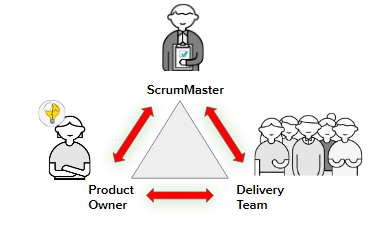
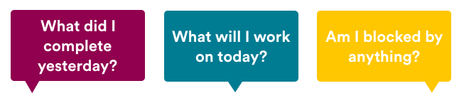

## Opening

The Scrum approach (Schwaber, 2004; Schwaber and Beedle, 2001) is a general
agile method but its focus is on managing iterative development rather than specific
technical approaches to agile software engineering.Scrum does not prescribe the use of programming practices such
as pair programming and test-first development. It can therefore be used with more technical
agile approaches, such as XP, to provide a management framework for the project.
## Overview of Scrum Roles and the Sprint Cycle

There are three common roles on an Agile Scrum team:

*	Product owner.
*	Scrum master.
*	Delivery team.

The **product owner** owns “what” is desired and “why” it’s desired. They are responsible for prioritizing work. They are the voice of the customer and understand the big picture, business, competition, customers, trends, etc.

The **Scrum master** is the keeper of the Scrum process. They are facilitators whose goal is to always work to make the team its most efficient self. They used to be considered project managers, but this role focuses more on facilitating and creating team efficiency. They may work with other teams to get resources, training, or other support.

**The Scrum delivery team** owns “how” and “how quickly” work is delivered. This team includes everyone responsible for delivering work. It is usually made up of engineering and design people, but may include marketing, support, and operations.

**There are three phases in Scrum** 
  * The first is an outline planning phase where you
establish the general objectives for the project and design the software architecture.
  * This is followed by a series of sprint cycles, where each cycle develops an increment
of the system. 
  * Finally, the project closure phase wraps up the project, completes
required documentation such as system help frames and user manuals, and assesses
the lessons learned from the project.

### Scrum and the Sprint Cycle

**Step 1: Plan**

Ask yourself, “What feature is most valuable to the customer?” and build that first. Collaborate with the business, if possible, to help pin down customer preferences.

**Step 2: Design**

Mock up a complete solution that includes front-end, back-end, and middleware. At this point, the team collaborates to create a full list of technical tasks.

**Step 3: Build**

Write the code. The groundwork you laid in the previous two steps really pays off here, keeping everyone organized and focused on a task. Frequent check-ins are strongly advised to ensure compatibility and minimize unexpected roadblocks.

**Step 4: Test**

Put the software through its paces. Make sure everything works as expected and integrates properly with existing software.

**Step 5: Deploy**

Get the software into customers’ hands. The speed of this process can be astonishing, especially if you’re used to the traditional way of doing things. The trade-off for all this speed is that unit testing becomes an essential part of the process for every piece of functionality in the software. This sounds challenging at first, but the continuous deployment environment makes it less daunting.

A mature Agile system is able to complete all five of these steps in a single sprint. This means the software is able to be used from the very first sprint onward. Every sprint after that has the application growing in functionality and value through slow iteration.

---

## The Four Ceremonies

A sprint is a short, timeboxed period (often two weeks) in which a team completes a set amount of work. A lot happens in that period (work gets done, products get launched) and then the whole thing starts again.

To help teams stay on track, four ceremonies occur at different points in the sprint to make sure work is completed as efficiently as possible. These include:

*	Sprint planning
*	Daily standups
*	Sprint reviews
*	Retrospectives

### Before You Get Started

Before you get started, the backlog must be complete and in order. The backlog is a list of user stories, bugs, and other work in priority order. The backlog is owned by the product owner, and the order is determined by the product management team. During the course of the project, the backlog will be constantly “groomed,” with the highest-priority tickets appearing at the top.

### Sprint Planning: First Things First

Once the backlog is in order, you’re ready to turn your ideas into something usable. That’s what you’ll do in **sprint planning**: Review what needs to get done and clarify the tasks so that the development team is ready to start building.

Sprint planning is one of the Scrum rituals that needs to be followed. Sprint planning happens right before a sprint starts. The goal of sprint planning is to make sure that the tickets in your backlog are ready to be moved into that sprint planning backlog as well. Your sprint planning backlog is a subset of the product backlog; it’s whatever is highest priority and needs to get done in the upcoming sprint. 

In the sprint planning meeting, you need to be able to present the user story, along with acceptance criteria, to your development team. As a product manager, your job is to make sure that you’ve really identified the “what” they need to build and the “why” they need to build it; let your development team figure out the “how.”

### Time to Stand Up

| Attendees | When | Duration  | Inputs | Purpose | 
| :-----: |:-------:|:-----:|:-----:|:-----:|
|Product owner, development team, and Scrum master| Once a day, often in the morning. | No more than 15 minutes. | None — just attendance from all team members. | Quickly inform everyone of what’s going on across the team and identify anything that’s blocking progress. |

No one likes standing for too long, right? That’s why **standups** have a time limit of 15 minutes (ideally less). If you’re having a daily meeting, it’s best not to overwhelm everyone and instead keep it short and concise.

To honor that time limit, team members should come prepared to answer these three questions:

These prompts keep everyone focused on progress and forward movement. Any blockers or issues that arise during the standup can be discussed after the fact, rather than during the meeting with the entire team involved.

### Sprint Review: It’s Demo Day!

The last day of the sprint means it’s time for the sprint review, also known as **demo day**. It’s critical to showcase your work to your team and stakeholders, get feedback, and celebrate accomplishments. The most important part of a sprint review? Making sure that you have an actual, working product to show (or at least a feature of it).

| Attendees | When | Duration  | Inputs | Purpose | 
| :-----: |:-------:|:-----:|:-----:|:-----:|
|Product owner, development team, Scrum master, and stakeholders| At the end of a sprint or milestone. | 30–45 minutes | Work that has been completed in the sprint. | Share what’s been built, answer questions, get feedback, and, most importantly, celebrate the team’s hard work! |

### Retros: Wrapping Up

Once the sprint is wrapped up and the product is reviewed, take the time to conduct a **retrospective** (“retro” for short) with your team. If a sprint review looks at what was created, the retro looks at how it got done — what works, what doesn’t, and how to keep getting better.

| Attendees | When | Duration  | Inputs | Purpose | 
| :-----: |:-------:|:-----:|:-----:|:-----:|
|Product owner, development team, and Scrum master| At the end of a sprint, after the sprint review. | 30–45 minutes. | Nothing specific. | Uncover what’s working well, discuss what’s not working, and create a plan to improve how the team operates together. |

---

## Conclusion

Scrum, as originally designed, was intended for use with co-located teams where
all team members could get together every day in stand-up meetings. However,
much software development now involves distributed teams with team members
located in different places around the world. Consequently, there are various experiments
going on to develop Scrum for distributed development environments (Smits
and Pshigoda, 2007; Sutherland et al., 2007).

